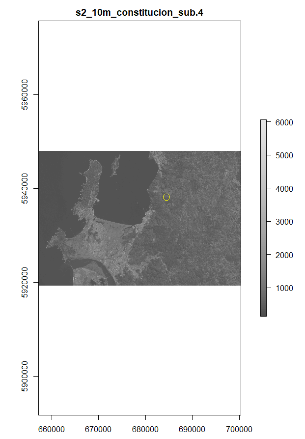
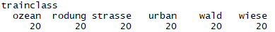

## Supervised Classification of a Sentinel-2 image with R ##

### Overview ###

In this lecture you will learn how to perform a supervised classification using a Sentinel-2 image in R. The learned processing steps include:

- Loading Sentinel-2 data
- Visualizing Sentinel-2 data
- Overlaying a Sentinel-2 image with a point-Shapefile (containing the reference data) and extract reflectance values
- Train a supervised classification algorithm using the extracted reflectance values
- validate the supervised classification with two different approaches
- apply the trained classifier to the full image to derive a classification map

The datasets applied in this tutorial are available here:

[https://drive.google.com/open?id=11CR5p08W-zJKB4q2znNhl_mg1HYWMWSq](https://drive.google.com/open?id=11CR5p08W-zJKB4q2znNhl_mg1HYWMWSq)

### Datasets used in this Tutorial ###

In this tutorial we will use a Sentinel-2 image which has been preprocessed as described in the following Tutorial: 

[https://drive.google.com/open?id=1NViCrOVSM0AhPiG6OO_Cmipzz9JANLjj](https://drive.google.com/open?id=1NViCrOVSM0AhPiG6OO_Cmipzz9JANLjj)

Original Sentinel-2 datasetd can be downloaded from several webpages including the USGS Earth explorer (the same webpage where we downloaded our Landsat data), as well as the official ESA Science Data Hub. How to download the corresponding images will be demonstrated in the course. The links can be found below as well as on the ILIAS page of the course:

[https://earthexplorer.usgs.gov/](https://earthexplorer.usgs.gov/) .

[https://scihub.copernicus.eu/dhus/#/home](https://scihub.copernicus.eu/dhus/#/home)

### Step 1: Loading Sentinel-2 data ###

As first step, load all necessary R packages by executing the following code:

	pkgs<-c("rgdal","caret","raster","foreign", "kernlab", "e1071", "Hmisc", "randomForest")
	lapply(pkgs,require, character.only=T)

R will give you a warning message in case a package is not installed yet. If this is the case, please install the packages either through the main menu of Rstudio by selecting **"Tools" =>** **"Install packages"** and then following the appearing dialogue, or by entering the corresponding R code to install the packages into the console. E.g., to install the package "raster" use the code:

	install.packages("raster")	

After all packages are successfully installed, load the images using two steps. First, change the path to the folder containing the image, then execute the stack command to load the image. To check whether you are in the correct folder, you can display all files of the folder using the **list.files()**-command:

	setwd("D:/Remote_sensing/Tag1_supervised_class_s2")
	list.files()
	s2_img <- stack("s2_10m_constitucion_sub.tif")

The stack command does not yet load the whole dataset into the memory but just reads the meta-data of the file and establishes links to the data on the hard drive. We can varify this by running:

	inMemory(s2_img)

Finally, run the variable name to obtain a summary of the raster file:

	s2_img

You should already be familiar with the console outputs from the preceding Tutorial.

### Step 2:  Checking basic properties of the Sentinel-2 image ###

After loading the Sentinel-2 scene, we would like to get a better  understanding of its properties. We can hence use some basic commands available in R. In the following, there will be a list of commands and the corresponding console outputs.

To check the number of pixels in x-direction of the image we use:

	ncol(s2_img)

	
To check the number of pixels in y-direction:

	nrow(s2_img)

To get a summary of all bands of the image:	

	s2_img@layers

To get a summary of a specific band:
	
	s2_img@layers[5]

To see the spatial extent of the image:
	
	extent(s2_img)

To check the coordinate reference system of the image:
	
	crs(s2_img)

To check the origin of the image:
	
	origin(s2_img)

### Step 3:  Visualizing the Sentinel-2 image ###

As next step, we will visualize the Sentinel-2 image using some of the commands which we are already familiar with from the first Tutorial but also some additional commands, which we not yet know.

Let's start with a RGB-Plot. To plot an image simulating the impression of our eye, we have to use the band combination 4, 3, 2 with the loaded Sentinel-2 scene:

	plotRGB(s2_img, r=4, g=3, b=2, stretch="hist")

This will result in the following plot:

Next we will plot an individual band of the Sentinel-2 image using first the standard color-palette of R and then a grey-color palette and finally we will add some transparency:

	plot(s2_img[[5]]) 
	# this does the same as the line above
	plot(s2_img, 5) 
	# this will change the color palette
	plot(s2_img, 5, col=grey.colors(100))
	# this will add some transparency
	plot(s2_img, 5, col=grey.colors(100), alpha=0.5)
	
This will result in the following plots:

	
As already done in the Landsat-Tutorial, we will again calculate a NDVI image and plot it using the standard color-palette and the grey-color palette (be aware that you have to know the correct NIR band!! This will depend on how you pre-processed your Sentinel-2 image):

	## calculate an NDVI from the Sentinel-2 image
	ndvi_s2 <- (s2_img[[7]] - s2_img[[3]])/(s2_img[[7]] + s2_img[[3]])
	# plot the ndvi image
	plot(ndvi_s2)
	# plot NDVI in grey colors
	plot(ndvi_s2, col=grey.colors(100))

This will result in the following plots:

	

Finally, we will explore another new option for plotting. That is, we will plot the spectrum of an individual pixel alongside its location in the image. To do this we first prepare the plot by using the commands:

	dev.off()
	x11()
	par(mfrow=c(1,2))

The first command will close all earlier plots, the second command will open a new plot window and the third command will then prepare the plot window to allow for plotting two plots next to each other. The **mfrow=c(1,2)** defines the number of rows and columns of a matrix that represents the overall number of plot-panels. In the given case there will be one row and two columns, that is, two panels next to each other. On the other hand, the command **mfrow=c(3,1)** would for example produce a three panel plot where all panels are plotted each other in a single column.

Be aware that these commands did not yet cause a plot, but were only preparing the plotting window. Next, we will define which pixel we want to plot.

For this we use the code:

	x = 2402000

This means, we will plot the 2402000th pixel of the image. To understand where this pixel is located we will now first create an RGB plot and than add a point to a grey-scale plot of a single Sentinel-2 band to indicate the location of the 2402000th pixel.

We run the code:

	# the following four lines will first plot a grey-scale image of the red band of the Sentinel-2 scene
	plot(s2_img, 4, col=grey.colors(100))
	# then add a marker of the location of the pixel for which the spectra will be plotted
	par(new=T)
	points(((extent(s2_img)[1]+((x - (floor(x/ncol(s2_img)))*ncol(s2_img))*10))), (extent(s2_img)[4]-((round(x/ncol(s2_img))-1)*10)), col="yellow", cex=2)

This will result in the following plot:

**Exercise:** Have a close look at the **points()**-command and reflect whether you can understand what is happening here. Try to also use the help-function of R to better understand.

Then, to plot the spectrum of the corresponding pixel (marked with the little yellow circle in the plot above), we will use:

	plot(seq(1,10,1), s2_img[[1:10]][x], xlab="S2 Bands", ylab="Refl", type="o", pch=1)

Which will result in:

The plotted spectrum shows the reflectance values plotted over the ten Sentinel-2 bands (which were kept after pre-processing). Be aware that this is not a normal spectrum but rather a simplified plot as we use the band numbers on the x-axis and not the wavelength. 

**Exercise:** Try to come-up with a plot to show a real spectrum for the Sentinel-2 image. To achieve this, you will have to look-up the wavelength centers of the 10 bands and integrate this information into the plot. Tipp: You will have to replace the code-part "seq(1,10,1)".

### Step 4:  Loading and visualizing the vector-file containing the training data ###

Now, we will load the vector-file (in this case a Point-Shapefile) containing the reference information for the supervised classification. How to create this Shapefile will be demonstrated in the course. General information on how to create a Point-Shapefile in QGIS can be found here:

[https://drive.google.com/open?id=0B8AhdWgotwHTYnEwNTVPX3lROXc](https://drive.google.com/open?id=0B8AhdWgotwHTYnEwNTVPX3lROXc)

To load the file we use the code:

	tr_data <- readOGR(".", "classes")

This will give you the following console output:

We can now access the information stored in the Shapefile using some basic commands. For example, to access the attribute table of the Shapefile we can use:

	tr_data@data

This will depict the complete table and produce a rather long console output. To have a look at only the first few rows in the attribute table we can use:

	head(tr_data@data)

which will result in:

As we can see, we have a table with two columns, the first one (id) containing a class-id and the second one (class) describing the class of interest - which is the land-cover reference information. To have a better understanding of how many and which classes we are dealing with, we can have a closer look at the second column by running:

	table(tr_data[,2])

This will result in the following console output:

So we can now see that the attribute table of the Shapefile contains 120 rows in total and these rows split up to 6 classes with each 20 samples. In case we would be interested in only a subset of these classes, we could create a subset of the shapefile by running for example a code like this:

	tr_data_sub <- tr_data[tr_data@data[,2] %in% c("ozean", "strasse", "wiese"),]
	table(tr_data_sub@data[,2])

As we can see, this results in a subset of the Shapefile which only contains the rows/samples for the classes "ozean", "strasse" and "wiese".

As next step, we will plot the extent of our vector-file over the satellite image. We accomplish this using the following code:

	# close all former plots
	dev.off()
	# open a new plot window
	x11()
	# plot satellite image
	plotRGB(s2_img, r=4, g=3, b=2, stretch="hist")
	# plot extent of the shapefile
	plot(extent(tr_data), add=T, col="red)

This will result in:

We can now see that the extent of the Shapefile and the raster-file overlap quite well. As next step, we will plot the individual points contained in the shapefile. We will additionally use different colors for the different classes. We run:

	plot(tr_data, col=tr_data$class, bg="transparent", add=T, cex=2)

This results in:

### Step 5:  Extract spectral values at the point locations and train and apply the classification algorithm ###

As next step, we will run the supervised classification. To do this, we will at this point define several output-files that will be used in the reminder of the code. Furthermore, we will switch the current path to an output folder.

We run:

	# set output directory
	setwd("D:/Remote_sensing/Tag1_supervised_class_s2/output")

	# define output filenames
	## !! these have to be changed for each input image - otherwise results will be overwritten!!
	
	## filename for a table that will contain the accuracies for 100 iterative classification runs (last part of the script) 
	out2 <- "boxplots_table_S2.txt"
	## filename for a pdf file that will contain boxplots of the values described for the first output file
	out3 <- "boxplots_S2.pdf"
	## filename for a textfile that will allow to create a summarized confusion matrix for the 100 iterative classification runs (last part of the script) 
	out4 <- "summed_conf_S2.txt"
	## filename for a geotiff file that will contain the classification map when applying the SVM classifier 
	outImage1 <-'SVM_classification_S2.tif'
	## filename for a textfile that will give a first rough idea of the accuracies by conducting a 5-fold cross-validation
	res_cv <- "results_cross_validation_basic_S2.txt"

The exact meaning of the individual output-files will be discussed further below once we reach the corresponding parts in the classification script.

Now, we will conduct several preparatory steps to run the supervised classification using the reference data in the vector file and the image. First, we will extract the information about the classes stored in the attribute table into an own variable by running:

	trainclass <- as.factor(tr_data@data$class)
	# or alternatively
	trainclass <- as.factor(tr_data@data[,2])

Be aware that we are using the command **as.factor()** to transform the data-type from "character"/"string" to "factor". The factor-datatype is used whenever we are working with discrete classes.

We can have a closer look at our new variable using:

	table(trainclass)
	levels(trainclass)

which will result in:

and

Next, we will copy our satellite image and the vector-file containing the training data into new variables. This step is not absolutely necessary but has proven to be useful as it separates the preparation steps taken above in the code from the actual classification. This could for example be relevant if the variable names of the images change several times. This could for example happen because several images are stacked on top of each other to make use of multi-temporal information, or if data from two sensors are combined. 

So we run:

	# to store the satellite image into the variable satImage
	satImage <- s2_img
	# to store the vector file into the variable vec
	vec <- tr_data

In the next step, we will overlay the image with the vector file and extract the pixel-values of those pixels that co-align with one of the points stored in the vector file. This process may take some time depending on the number of points applied. Furthermore, points will generally work a lot faster than polygons for this extraction process.

	trainval1 <- extract(satImage, vec, fun=mean)

Be aware that the defined function **fun=mean** will take no effect on the given process as we are working with a point-shapefile. In case we would be working with a polygon-shapefile, this part of the command would force the algorithm to extract all pixels overlapping with the polygon and calculate their mean values for each band. On the other hand, if no function is defined, the algorithm would simply extract all individual pixels overlapping with the polygon and store them into a list-variable.

In our case, each point will only overlap with a single pixel. Hence, the extracted values will be a table with number of rows = number of point in the shapefile and number of columns = number of bands in the image.

We can check this using the **str()** command and  comparing the resulting console outputs for the **trainval1** variable with the properties of the image and the point-shapefile:

	str(trainval1)

This will give the console-output:

We can see that trainval1 is a numeric table with 120 rows and 10 columns. This matches the number of samples of the point-shapefile and the number of bands of the image:

	nlayers(satImage)

	length(vec)

In combination with the **trainclass** variable (containing the reference classes of the 120 samples) that we already prepared above, we now have everything ready to train our supervised classification algorithm.	
As first step, we will use the command:

	set.seed(1173)

This command should always be used if in the following part of the code, a command is executed that contains a random component. That is, for some step, random numbers are being created. Normally, the use of random numbers would lead to the situation that every time we run our script, we will create slightly differing results. The **set.seed()** command will make sure that always the same random numbers will be created, once we re-run the code. 

After setting the seed-values, we will now perform a so called **grid-search** to identify the ideal parameter settings for the applied classification algorithm. We will in this case apply a **support vector machines (SVM)** classifier. SVM has two parameters that can be changes. These parameter are called **gamma** and **cost**. You learned in the lecture today how these two parameters affect the classification output. More detailed information can be found in the SVM chapter of this book:

[https://drive.google.com/open?id=0B8AhdWgotwHTenRmdmo1VlFrMWs](https://drive.google.com/open?id=0B8AhdWgotwHTenRmdmo1VlFrMWs)

To perform the grid-search we will now define two sequences of values that will be tested for gamma and cost:

	gammat = seq(.1, .9, by = .1)
	costt = seq(1,128, by = 12)

We can have a look at the created sequences by running the variables:

	gammat

	costt

In the following grid-search all combinations of these values will be tested for gamma and cost in a large number of classification runs where always a subset of the samples will be used as training and the remainder of the samples as validation. Depending on the number of available samples and the number of values defined for gamma and cost, this process can take a long time. To initiate the grid search we run:

	tune1 <- tune.svm(trainval1, as.factor(trainclass), gamma = gammat, cost=costt)

As you can see, we provide the function the extracted pixel values stored in the table **trainval1** as well as the reference classes stored in the factor-vector **trainclass**. Furthermore, we use the just-defined sequences of gamma and cost-values (gammat, costt).

We then have a look at the results by running:

	plot(tune1)

Which results in the following plot:

This plot describes the obtained errors for each examined parameter combination. That is, the darker blue an area is, the better it performed during the grid search. In our case, cost seems to have only a marginal influence on the accuracy of the classification, while we can observe that the error tends to increase with an increasing gamma value. The given plot is a rather untypical result for a grid search which mostly relates to the fact, that the classes considered in our example are rather easy to separate (that is also why the errors are very low). Once you apply the same work-flow to more challenging classification problems, the grid-search outputs may become a lot more complex.

Be aware that the values defined above for the gamma and cost sequences (costt, gammat) are more or less based on our experience. We might have to further extent them or refine them for other classification problems to obtain a suitable result.

We can now extract the optimal values for gamma and cost (in terms of classification accuracy) using the following commands:

	gamma <- tune1$best.parameters$gamma
	cost <- tune1$best.parameters$cost

And then have a look at the values by running the variable names:

	gamma

	cost

Both values show the minimal value examined, which again indicates that the classification problem was rather easy to solve.

We are now ready to train our general SVM model using the optimal gamma and cost values which we just determined. We will use two approaches to train the model. In the first option, we will use all available training data to train a model that uses all available information. In the second option, we will apply a five-fold cross-validation to get a first idea of how well the classification performs. To do this, we run:

	# train the model with all available samples
	model <- svm(trainval1, as.factor(trainclass), gamma = gamma, cost = cost, probability = TRUE)
	# train model with 5-fold cross-validation to get first impression on accuracies
	model2 <- svm(trainval1, as.factor(trainclass), gamma = gamma, cost = cost, probability = TRUE, cross=5)
	
We can now check the accuracies of the five-fold cross-validation by running:

	summary(model2)

This will give us the output:

Our first impression from the grid-seach that the classification works very well is confirmed. From the five classification runs, we reached 100% accuracy in four runs and 95.8% accuracy in one of the runs.

As this is already relevant information, we would like to stores these results into a text-file. To do this we run:

	sink(res_cv)
	summary(model2)
	sink()

The **sink()** command allows to open the connection to a textfile (in this case defined in the variable **Res_cv** which we created above). After this connection is opened, all console outputs will be directly written into the defined textfile - and no outputs will be visible in the consolte itself. Once we have all information plotted to the textfile, we can use the **sink()** command once more without any variable to close the connection.

After the successful training of the model, we will now apply the model to the complete image. This is accomplished using the command:
	
	svmPred <- predict(satImage, model, filename=outImage1, na.rm=TRUE, progress='text', format='GTiff', datatype='INT1U',overwrite=TRUE)

The **predict()** command is a quite general R-command that can be used for many different types of models. In our case,the function requires to define the image on which the model should be predicted ( **satImage** ) and the model that shall be used for prediction ( **model** ). We define **na.rm** to **TRUE** to make sure that the image is classified eventhough there might be NA values in the image (e.g., due to cloud-masking). In the given example, we furthermore define a filename (variable **outImage1** as defined above), format (**GTiff** that is a geotiff-file) and datatype (**INT1U** = unsigned integer) as we want the classification image also to be stored on the hard-disc. With the **overwrite** command we force the function to overwrite earlier created images with the same filename (this might not always be the best option!!!). 

After this step, we will have our classification map  (SVM_classification_S2.tif) stored in the output folder.

We can have a look at the classification map using:

	plot(svmPred)

Which should result in the following plot:

### Step 6:  Apply an iterative validation procedure ###

As last step in this supervised classification workflow, we will apply an iterative validation procedure to get a better idea how the classification algorithm performs for the individual land-cover classes as well as for the overall performance. While we already have a first idea about the accuracy of the classification from the five-fold cross-validation applied above, this additional step allows to make a more thorough evaluation of the accuracy. Particularly, we will investigate how differing compositions of training and validation data affect the accuracy of the classification.

This iterative validation will be conducted in a **for-loop** construction. To prepare the whole process, we will first conduct some preparatory steps:

We run:

	# we use the cbind() command to bind the reference vector containing the reference classes and the spectral values into a single dataframe
	data.df<-cbind(trainclass,trainval1)
	
	# we obtain the number of samples contained in the dataset
	N1<-length(data.df[,1])

	# We set the number of iterations for the iterative validation (this is user-defined and can be changed)
	N<-100

Then, we will create an empty matrix that will store the Producer's and User's Accuracies of each class (that means we need two columns per class) and two additional columns for overall accuracy and kappa:

	results <- matrix(nrow=N, ncol=(((nlevels(trainclass)*2)+2)))

As next step, we will create another empty matrix in which we will store the confusion matrices of the **N1** iterative classifications. To create this empty matrix, we will first obtain the number of land-cover classes used in the fiven classification and then take the squared value of the number of classes. We run:

	CL <- length(table(trainclass))
	CL2 <- CL^2

Then we create the empty matrix with:

	cmat <- matrix(0, ncol=CL2, nrow=N)

In our case this will lead to a matrix with 6^2 = 36 columns and 100 rows. You can verify this using: 

	str(cmat)

We always need the squared value of the number of classes as we will store a complete confusion matrix in each row of the matrix. You have already learned about confusion matrices and Producer's and User's accuracies  during the course. In case you cannot remember, have another look at the following material:

[https://drive.google.com/open?id=1q5OpDW7QaKCDaHTorcq_2Fi61hbo-qWb](https://drive.google.com/open?id=1q5OpDW7QaKCDaHTorcq_2Fi61hbo-qWb)

Now, we are ready to run the complete **for-loop**. You can find more details on what this part of the code is during, directly in the comments within the code:

	for (i in 1:N){
	
	  # split the data in test and training data using a bootstrap splot procedure (more
	  # details in the course) 
	  idx=sample(1:N1,N1,replace=TRUE)
	  # create training data subset
	  training.df<-data.df[idx,]
	  # create test data subset
	  testing.df<-data.df[-idx,]
	  
	  # prepare predictors for classification (take all columns containing spectral values)
	  predTest<-testing.df[,c(2:d)]
	  # prepare response for clsasification (take the column containing the response values = land-cover classes)
	  predClass<-testing.df[,c(1)]
	
	  #train the algorithm
	  #select between SVM and RF here
	
	  svmFit1 <-svm(training.df[,c(2:d)],as.factor(training.df[,c(1)]), gamma = gamma, cost = cost, probability = TRUE)
	
	  #apply the algorithm to the test dataset extracted above
	  
	  pred<-predict(svmFit1,predTest)
	
	  # now calculate the confusion matrix
	  # there is an additional step integrated in the script to ensure that all classes are available in the 
	  # training and the validation sets
	  if (nlevels(pred) == nlevels(as.factor(predClass))) {
	    
	    # calculate confusion matrix using a function of the R package caret
	    # this will create a new object (called con.mat in this script) which
	    # contains all relevant accuracies which will be extracted and stored for all
	    # classes in the reminder of the loop
	    con.mat<-confusionMatrix(pred,predClass)
	
	    # extract accuracies values
	    for (i2 in 1:(nlevels(trainclass))) {
	
	        if (nlevels(as.factor(predClass)) > 2) {
	          results[i,i2]<-con.mat$byClass[i2,1] # producer's accuracies
	        }
	        else {
	          results[i,i2]<-con.mat$byClass[1]
	        }
	        if (nlevels(as.factor(predClass)) > 2) {
	        results[i,(i2+nlevels(trainclass))]<-con.mat$byClass[i2,3] # user's accuracies
	        }
	        else {
	          results[i,(i2+nlevels(trainclass))]<-con.mat$byClass[3]
	        }
	      }
	  
		# store the extracted accuracie values in the matrices
	    results[i, ((nlevels(trainclass)*2)+1)] <- con.mat$overall[1] # overall accuracy
	    results[i, ((nlevels(trainclass)*2)+2)] <- con.mat$overall[2] # kappa
	
		# store the confusion matrix into the corresponding row of the empty matrix
	    cm <- table(predClass, pred)
	    cmat[i,1:CL2] <- cm[1:CL2] }
	}

Try to have a closer look over this for-loop and try to understand what this part of the code is doing. It is coded in a rather complex way to make sure that it works independently from the number of land-cover classes in the dataset.

As final step of this Tutorial we will now store all results to a text-file and create a plot that will summarize the most important results in a composition of box-plot. To do this we run:

	# save accuracies
	write.table(results, out2, sep="\t")
	# save confusion matrix (number of samples classified into the different classes)
	write.table(cmat, out4, sep="\t")

This will create two text-files containing all the raw-results obtained during the for-loop. The file will be stored in the currently defined output-folder.

Then we run:

	## prepare the names of all classes in a generic way to create the boxplot (real class names have to be adapted manually)
	names1 <- paste0("PA_cl", 1:nlevels(trainclass))
	names2 <- paste0("UA_cl", 1:nlevels(trainclass))
	names <- matrix(nrow=1,ncol=(nlevels(trainclass)*2+2))
	names[1:nlevels(trainclass)] <- names1
	names[(nlevels(trainclass)+1):(nlevels(trainclass)*2)] <- names2
	names[(nlevels(trainclass)*2)+1] <- "OA"
	names[(nlevels(trainclass)*2)+2] <- "kappa"
	
	# create boxplot
	
	pdf(file = out3, width = 12, height = 6)
	boxplot(results, notch=TRUE, ylim=c(0,1), las=2, names=names)
	dev.off()

This will create pdf-file containing a composit of boxplots which should look like this:

This plot summarizes all classification results obtained during the 100 runs with varying training and validation datasets. For each land-cover class, the range of User's Accuracy (UA..cl) and Producer's Accuracy (P..cl) obtained in the 100 iterations is displayed. Furthermore, the Overall Accuracy (OA) and kappa values of the 100 runs are summarized.

In our example we can observe, that the Producer's and User's accuracy were perfect (1 = 100% accuracy) in almost all classes and almost all of our 100 classification runs. Only the Producer's Accuracy of class 5 and the User's Accuracy of class 6 show some runs with worse accuracies.

This is a rather unusual result, and it is likely that if you conduct your own classifications with more challenging classification problems, the boxplots will spread out further and range into the lower accuracy areas.

### Exercise ###

Try to download your own Sentinel-2 dataset from one of the webpages listed above. Apply the pre-processing steps described in the Tutorial available in ILIAS. Then collect your own training dataset for example by using QGIS and the open-layers plugin and re-run the complete classification with classes that you defined yourself. 
